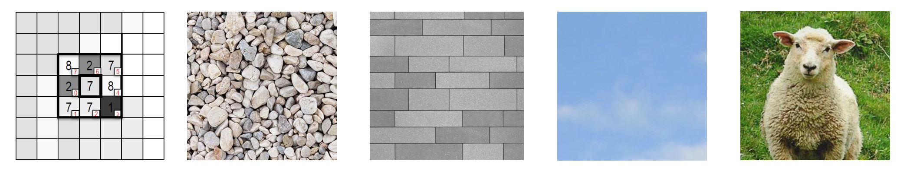

# CEIA_computer_vision_I

## Trabajo Práctico 1

Parte 1 (imágenes en /white_patch y /coord_cromaticas):
* Implementar el algoritmo de pasaje a coordenadas cromáticas para librarnos de las variaciones de contraste.
* Implementar el algoritmo White Patch (check qué no hayan puntos blancos en la imagen) para librarnos de las diferencias de color de iluminación.
* Mostrar los resultados obtenidos y analizar las posibles fallas (si es que las hay) en el caso de White patch.

Parte 2
* Para las imágenes img1_tp.png y img2_tp.png leerlas con OpenCV en escala de grises y visualizarlas.
* Elija el número de bins que crea conveniente y grafique su histograma, compare los histogramas entre si. Explicar lo que se observa, si tuviera que entrenar un modelo de clasificación/detección de imágenes, considera que puede ser de utilidad tomar como ‘features’ a los histogramas?
* Para la imagen segmentacion.png analice el histograma de los canales RGB. Segmente algunos de los elementos presentes en la imagen (agua, cielo, tierra) y muestre, aplicando mascaras, las regiones en imágenes separadas.

[RESOLUCIÓN DEL TRABAJO PRÁCTICO 1](/TPs_resueltos/TP1/TP1.ipynb)

## Trabajo Práctico 2
Implementar la función create_gauss_filter(h, w, k_size, sigma) para crear filtros gaussianos para filtrado espectral. Debe retornar un filtro gaussiano de tamaño HxW en dominio espacial y su transformada de Fourier.

1. Graficar ambas representaciones para diferentes tamaños de kernel y sigma. Aplicar el filtro una imagen para validar el funcionamiento en el dominio espectral.
2. Comparar el resultado de hacer un filtrado por convolución con el mismo kernel.

Para la imagen suministrada “metal grid”. Implementar un algoritmo que:

1. Calcule los gradientes en la imagen (dirección y módulo)
2. Muestre imágenes de ángulo y módulo
3. Marque con colores las direcciones de gradientes más representativos.

[RESOLUCIÓN DEL TRABAJO PRÁCTICO 2](/TPs_resueltos/TP2/TP2.ipynb)

## Trabajo Práctico 3

Encontrar el logotipo de la gaseosa dentro de las imágenes provistas en `Material_TPs/TP3/images` a partir del template `Material_TPs/TP3/template`

1. (4 puntos) Obtener una detección del logo en cada imagen sin falsos positivos
2. (4 puntos) Plantear y validar un algoritmo para múltiples detecciones en la imagen coca_multi.png con el mismo témplate del item 2
3. (2 puntos) Generalizar el algoritmo del item 2 para todas las imágenes.

Visualizar los resultados con bounding boxes en cada imagen mostrando el nivel de confianza de la detección.

[RESOLUCIÓN DEL TRABAJO PRÁCTICO 3](/TPs_resueltos/TP43/TP3.ipynb)

## Trabajo Práctico 4

Para las imágenes suministradas:

1. Implementar un extractor de características LBP básico (sin uniformidad, 8 vecinos)
2. Realizar el histograma de características LBP de la imagen
3. Comparar los histogramas

[RESOLUCIÓN DEL TRABAJO PRÁCTICO 4](/TPs_resueltos/TP4/TP4.ipynb)
